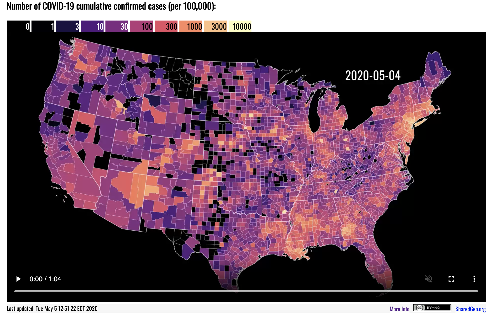

# `sf` package

First we'll take the `{sf}` package for a spin to reproduce this figure from [SharedGeo](https://www.sharedgeo.org/COVID-19/).[^sharedgeo]

[^sharedgeo]: Or you could add this as a footnote. https://www.sharedgeo.org/COVID-19/

```{r goal, echo=FALSE}
  
```

## Set Up

Load the packages we'll need for today.

```{r packages, message=FALSE}
  library(tidyverse)
  #library(tidycensus)
  # https://api.census.gov/data/key_signup.html
  #census_api_key("YOUR KEY HERE")
  library(sf)
  library(viridis)
  library(gganimate)
  library(leaflet)
```

We have two data sources: county-level COVID-19 data from the NY Times and county population and geographic data from the U.S. Census Bureau.

```{r load}
  covid <- read_csv("https://raw.githubusercontent.com/nytimes/covid-19-data/master/us-counties.csv")
  
  # counties <- get_acs(geography = "county",
  #                     variables = "B01003_001",
  #                     geometry = TRUE) 
  # 
  # states <- get_acs(geography = "state",
  #                   variables = "B01003_001",
  #                   geometry = TRUE)
  
  load("census.RData")
```

## Prep the Data

The original plot only shows the lower 48 states, so we have to exclude Alaska, Hawaii, DC, and Puerto Rico from the COVID data and from the boundary files. 

### COVID-19

```{r prep}
  covidPrepped <- covid %>%
    filter(state!="District of Columbia" &
           state!="Puerto Rico" &
           state!="Hawaii" &
           state!="Alaska") %>%
    select(date, fips, cases, deaths) %>%
    mutate(date = lubridate::ymd(date)) %>%
    mutate(fips = stringr::str_pad(fips, width=5, pad="0")) %>%
    filter(date == "2020-05-04")
```

### Population/Geographic

```{r geo}
  counties <- 
    counties %>%
    filter(!grepl("Hawaii", NAME)) %>%
    filter(!grepl("Puerto Rico", NAME)) %>%
    filter(!grepl("District of Columbia", NAME)) %>%
    filter(!grepl("Alaska", NAME)) 
  
  states <- 
  states %>%
    filter(NAME!="District of Columbia" &
           NAME!="Puerto Rico" &
           NAME!="Hawaii" &
           NAME!="Alaska")
```

### Join the COVID data to the counties

```{r join}
  joined <- counties %>%
    left_join(covidPrepped, by = c("GEOID" = "fips"))
```

### Fill in for missing data

```{r complete}
  completed <- joined %>%
    complete(GEOID, date, fill = list(cases = 0)) %>%
    select(GEOID, date, cases) 
```


### Rejoin

```{r rejoin}
  rejoined <- completed %>%
    left_join(select(counties, GEOID, NAME, estimate, geometry),
              by = "GEOID") %>%
    st_as_sf()
```

### Construct

```{r construct}
  constructed <- rejoined %>%
    mutate(casesPop = ifelse(is.na(cases), 0, cases)) %>%
    mutate(casesPop = (cases/estimate)*100000) %>%
    mutate(group = cut(casesPop, 
                       breaks = c(0, 1, 3, 10, 30, 100, 
                                  300, 1000, 3000, 10000, 
                                  Inf),
                       labels = c(0, 1, 3, 10, 30, 100, 
                                  300, 1000, 3000, 10000),
                       include.lowest = TRUE)
    ) %>%
    mutate(month = lubridate::month(date, 
                                    label=TRUE, 
                                    abbr=TRUE),
           day = lubridate::day(date),
           monthDay = paste(month, day, sep=" "),
           dayLabel = lubridate::wday(date)) %>%
    filter(date=="2020-05-04") %>%
    select(monthDay, GEOID, geometry, group)
```

## Plot 

```{r}
  constructed %>% 
    ggplot() +
      geom_sf(aes(fill = group), color = "white", size=.1) +
      geom_sf(data=states, fill=NA, color="white", size=.3) +
      scale_fill_viridis_d(option = "magma", drop=FALSE) +
      labs(title = "Number of COVID-19 cumulative\nconfirmed cases (per 100,000):",
           subtitle = 'May 5, 2020',
           caption = "Data: NYTimes, https://github.com/nytimes/covid-19-data",
           x="",
           y="") +
      coord_sf(crs = "+proj=aea +lat_1=29.5 +lat_2=45.5 +lat_0=37.5 +lon_0=-96 +x_0=0 +y_0=0 +ellps=GRS80", 
               datum=NA) +
      theme_minimal() + 
      theme(panel.background = element_rect(fill = 'black'),
            plot.title.position = "plot",
            plot.title = element_text(size=20,
                                      face="bold"),
            plot.subtitle = element_text(size=15),
            plot.caption = element_text(size=10),
            legend.position = "top",
            legend.box = "horizontal",
            legend.title = element_blank(),
            legend.justification='left') +
      guides(fill = guide_legend(nrow = 1))
```


# `{leaflet}`

[`{leaflet}`](https://rstudio.github.io/leaflet/) is a simple to use yet powerful library for creating interactive maps. We're going to finish with a simple example that uses `{leaflet}` to overlay our `sf` object on an interactive map.

```{r leaf, warning=FALSE, message=FALSE}
  nc <- constructed %>%
    filter(monthDay=="May 5") %>%
    filter(substring(GEOID, 1, 2)=="37") %>%
    mutate(group = as.numeric(as.character(as.factor(group))))
  
  bins <- c(0, 1, 3, 10, 30, 100, 
            300, 1000, 3000, 10000, Inf)
  pal <- colorBin("YlOrRd", domain = nc$group, bins = bins)
  
  nc %>%
    leaflet() %>% 
    setView(lng = -78.8986, lat = 35.9940, zoom = 6) %>%
    
  # run chunk and then try another tile set
    addTiles() %>%
    #addProviderTiles(providers$Stamen.Toner) %>%
    #addProviderTiles(providers$CartoDB.Positron) %>%
    
    addPolygons(fillColor = ~pal(group),
                weight = .5,
                opacity = .7,
                color = "white") %>%
    addLegend(pal = pal, 
              values = ~group, 
              opacity = 0.7, 
              title = NULL,
              position = "bottomright")
```
