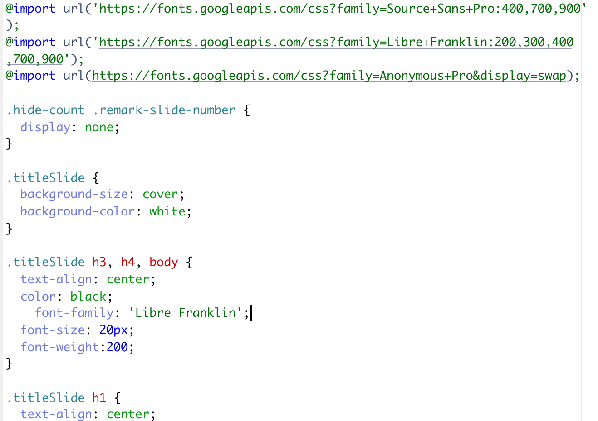

class: titleSlide, hide_logo

```{r setup, include=FALSE}
library(tidyverse)
library(xaringan)
library(xaringanExtra)
library(xaringanthemer)
library(here)
library(sysfonts)
library(showtext)
library(countdown)
library(lubridate)
library(patchwork)
library(socviz)
library(gapminder)
library(palmerpenguins)

options(htmltools.dir.version = FALSE)
knitr::opts_chunk$set(
  fig.width=9, fig.height=3.5, fig.retina=3,
  out.width = "100%",
  cache = FALSE,
  echo = TRUE,
  message = FALSE, 
  warning = FALSE,
  hiline = TRUE
)
```

```{r xaringan-panelset, echo=FALSE}
xaringanExtra::use_panelset()
```

```{r xaringan-editable, echo=FALSE}
xaringanExtra::use_editable(expires = 1)
```

```{r xaringan-extra-styles, echo=FALSE}
xaringanExtra::use_extra_styles(
  hover_code_line = TRUE,         #<<
  mute_unhighlighted_code = TRUE  #<<
)
```

```{r xaringanExtra-clipboard, echo=FALSE}
xaringanExtra::use_clipboard()
```

```{r share-again, echo=FALSE}
xaringanExtra::use_share_again()
xaringanExtra::style_share_again(share_buttons="none")
```

```{r xaringan-themer, include=FALSE, warning=FALSE, eval=T}
style_duo_accent(
  primary_color = "#1f9ac9",
  secondary_color = "#444444",
  header_font_google = google_font("Source Sans Pro"),
  text_font_google   = google_font("Libre Franklin", "300", "300i"),
  code_font_google   = google_font("Anonymous Pro"),
  base_font_size = "30px",
  text_font_size = "1rem",
  header_h1_font_size = "2.5rem",
  header_h2_font_size = "2rem",
  header_h3_font_size = "1.25rem",
  padding = "8px 32px 8px 32px",
)

font_add_google("Poppins", "Poppins")
font_add_google("Libre Franklin", "Frank")
showtext_auto()
```

```{r xaringan-logo, echo=FALSE, eval=FALSE}
xaringanExtra::use_logo(
  image_url = "logo.png"
)
```

# Communicating data science

## Xaringan html5 slides

<br>
<center></center>

---

class: left

# Why `{xaringan}` (and html5 slides)?

* Keeps your data pipeline short to work in RMarkdown
* Reproducible
* Easy to share html output
* Very customizable

---

class: left

### Open a new xaringan Rmd template

.pull-left[
```{r newxar, echo=FALSE}

```
]

.pull-right[
* `install.packages("xaringan")`
* If you have `xaringan` installed you should see `Ninja Presentation` as an option under `RMarkdown.../From Template`.
* BUT for this exercise please open `start.Rmd`
]
---

class: left

### Initial template

.pull-left[
```{r template2, echo=FALSE}

```
]

.pull-right[
* This is what the template looks like when you open a new file
* Notice that the `output` option in the YAML is `output: xaringan::moon_reader:`
]
---

class: left

### Knit the slides

```{r initialknit2, echo=FALSE}

```
---

class: left

### To the moon with infinite moon reader

.pull-left[
```{r imr2, echo=FALSE}

```
]

.pull-right[
* Click `addins` button in the IDE, search for "infinite", and select Infinite Moon Reader
* Once you `Knit` once, your preview of the slides will update every time you hit save
]
---

class: left

### Make some edits to the YAML

.pull-left[

````markdown
---
title: "Penguins!"
subtitle: "I love penguins"  
date: 'July 14, 2021'
output:
  xaringan::moon_reader:
    css: [xaringan-themer.css,custom_deck.css]
    nature:
      slideNumberFormat: "%current%"
      highlightStyle: github
      highlightLines: true
      ratio: 16:9
      countIncrementalSlides: true
    seal: false
---
````
]

.pull-right[
* These are optional changes
* Adding `seal: false` will let us create a custom title slide (more on that in a moment)
* Up next: `css: [xaringan-themer.css,custom_deck.css]`
]

---

class: left

### Changing the theme with CSS

.pull-left[

```{r css, echo=FALSE}

```
]

.pull-right[
* Writing CSS (cascading style sheets) is one way to change the look and feel of the deck
* In this example (included for you), we're creating a new class called `.titleSlide`
* We'll use it in a moment to style the title slide
]

---

class: left

### Add details for the title slide

.panelset[

.panel[.panel-name[Code]

````markdown
    seal: false
---
class: titleSlide 

`r ''````{r setup, include=FALSE}
library(tidyverse)
library(palmerpenguins)
options(htmltools.dir.version = FALSE)
knitr::opts_chunk$set(fig.width=9, fig.height=3.5, fig.retina=3, out.width = "100%", cache = FALSE, echo = TRUE, message = FALSE, warning = FALSE, hiline = TRUE)
```

# `r knitr::inline_expr("rmarkdown::metadata$title")`
# `r knitr::inline_expr("rmarkdown::metadata$subtitle")`
<br>
<center></center>
---
````
]

.panel[.panel-name[Explained]
* The slide starts where the YAML ends `---`
* `class: titleSlide` sets the design for the slide to be based on the custom class we created in `custom_deck.css` (provided for you)
* The `setup` chunk loads packages and sets knitting options
* `#` and `##` correspond to level 1 (h1 in css) and level 2 (h2) headings
* `r rmarkdown::metadata$title` pulls from the YAML metadata
* `<center></center>` points to the `penguins.png` file provided for you
* The slide ends with `---`
]

.panel[.panel-name[Rendered]
```{r title, echo=FALSE, out.width='70%'}

```
]

]

---

class: left

Add packages to your `setup` chunk to unlock more features

```{r, eval=FALSE}
library(xaringan)
library(xaringanthemer)
library(xaringanExtra)
```

---
class: left

### Style your deck with {`xaringanthemer`}

Put anywhere, after `setup` chunk would make sense. Check out {[`xaringanthemer`](https://pkg.garrickadenbuie.com/xaringanthemer/)}.

````markdown

`r ''````{r r xaringan-themer, include=FALSE, warning=FALSE}
style_duo_accent(
  primary_color = "#1889c9",
  secondary_color = "#fec52e",
  header_font_google = google_font("Source Sans Pro"),
  text_font_google   = google_font("Libre Franklin", "300", "300i"),
  code_font_google   = google_font("Anonymous Pro"),
  base_font_size = "30px",
  text_font_size = "1rem",
  header_h1_font_size = "2.5rem",
  header_h2_font_size = "2rem",
  header_h3_font_size = "1.25rem",
  padding = "8px 32px 8px 32px",
)
```
````

---

class: left

### Add a title and content

.pull-left[
````markdown
---

class: left

# This is a new slide

* This is my content

---
````
]

.pull-right[
```{r content, echo=FALSE, out.width='70%'}

```
]
---
class: left

### Try changing the class

(left, center, right) / (top, middle, bottom)

.pull-left[
````markdown
---

class: center

# This is a new slide

* This is my content

---
````
]

.pull-right[
````markdown
---

class: center, middle

# This is a new slide

* This is my content

---
````
]

---

class: left

### Create two columns with `.pull-left[]` and `.pull-right[]`

.pull-left[
````markdown
class: left

### A level 3 heading

.pull-left[
On the left 
]

.pull-right[
On the right
]
````
]

.pull-right[
```{r pull, echo=FALSE, out.width='70%'}

```
]

---

class: left, hide_logo, hide-count

### So many cool extras to consider

```{r ft, echo=FALSE}
knitr::include_url("https://pkg.garrickadenbuie.com/xaringanExtra/#/", height='90%')
```

---

class: left

### Create panels with `xaringanExtra::use_panelset()`

.panelset[
.panel[.panel-name[Code]
````markdown
---
class: left

`r ''````{r xaringan-panelset, echo=FALSE}
xaringanExtra::use_panelset()
```
### Panels
.panelset[
.panel[.panel-name[Panel 1]
Penguins!
]
.panel[.panel-name[Panel 2]
<center></center>
]
]

---
````
]

.panel[.panel-name[Rendered]
```{r panel, echo=FALSE, out.width='70%'}

```
]
]


---

class: left

### Use `eval=FALSE` and `ref.label=` to separate code and output 

.panelset[
.panel[.panel-name[Code]
````markdown
---
class: left
### Panels with code/output
.panelset[
.panel[.panel-name[Code]
`r ''````{r penguins, eval=FALSE}
ggplot(data = penguins, aes(x=species, y = flipper_length_mm, fill=species)) +
  geom_violin() + scale_fill_manual(values = c("darkorange","purple","cyan4")) +
  labs(y = "Flipper length (mm)", x = NULL, title = "Penguin flipper lengths") +   theme_minimal() + theme(legend.position = "none")
```
]
.panel[.panel-name[Plot]
`r ''````{r penguins-plot, ref.label="penguins", echo=FALSE}
```
]]
---
````
]

.panel[.panel-name[Rendered]
```{r panelsplot, echo=FALSE, out.width='70%'}

```
]
]

---
class: left

# Credits

Deck by Eric Green ([@ericpgreen](https://twitter.com/ericpgreen)), licensed under Creative Commons Attribution [CC BY-SA 4.0](https://creativecommons.org/licenses/by-sa/4.0/)
* {[`xaringan`](https://github.com/yihui/xaringan)} for slides with help from {[`xaringanExtra`](https://github.com/gadenbuie/xaringanExtra)}
* Allison Horst, [Palmer penguins artwork and vignettes](https://allisonhorst.github.io/palmerpenguins/articles/intro.html)
