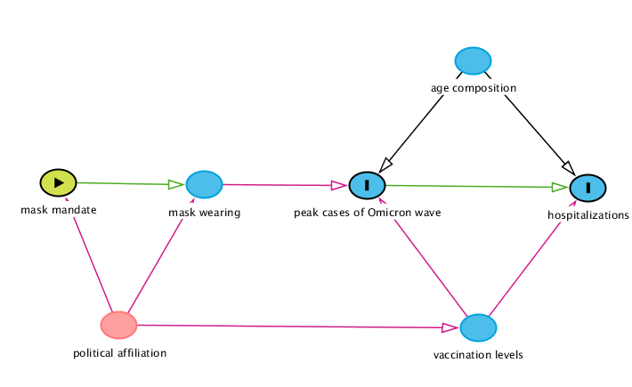
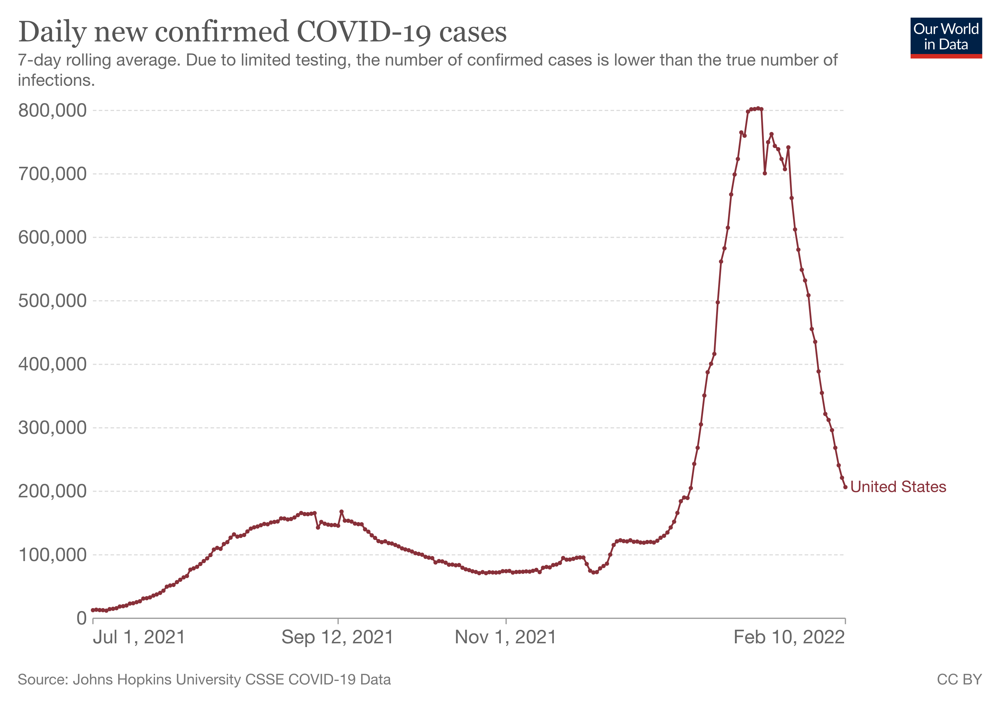

```{r setup, include=FALSE, warning = FALSE, message = FALSE}
  knitr::opts_chunk$set(echo = TRUE, warning = FALSE, message = FALSE)
  options(scipen=999) # turns off scientific notation
  
  library(tidyverse)
  library(googlesheets4)
  gs4_deauth()
  library(ggbeeswarm)
```

What can we say about mask mandates and SARS-CoV-2 transmission at the county level? That's our motivating question. In exploring this question, you'll have an opportunity to put your accumulated R knowledge to work. You'll import data, join tables, transform variables, work with strings and factors, and more.

# Data

Please consult [this directed acyclic graph](http://dagitty.net/dags.html?id=2Zk3dJ) (DAG) to understand what data you need to obtain. Never heard of DAGs? Consider [watching this excellent talk](https://www.youtube.com/watch?v=KNPYUVmY3NM) by Richard McElreath, author of ["Statistical Rethinking"](https://xcelab.net/rm/statistical-rethinking/). Fair warning: it's going to make you question every analysis you've ever run. It's optional viewing.

```{r dagpng, echo=FALSE}
  
```
<br>

DAGs can help you be clear on what you need to adjust for based on your assumptions. I know, your prior approach might have been to adjust for everything. That's common. Kitchen sink regressions. McElreath will have you re-thinking this strategy.

This DAG represents MY assumptions about the causal link between mask mandates, cases, and hospitalizations. I decided on the variables and drew the arrows. The logic of DAGs determined the minimal adjustment set for causal effect identification.

This DAG tells us that to estimate the total effect of mask mandates on cases/hospitalizations, we only need to adjust for political affiliation. To understand why this is the minimal adjustment set in the logic of DAGs, you'd need to read up on DAGs or watch the video. **That's not necessary** unless you want to draw your own DAG. I don't think that's necessary because the primary learning goal here is the pre-inference data wrangling.

```{r dag, eval=FALSE, echo=FALSE}
# you can use the code from dagitty.net to draw DAGs in R
# library(ggdag)
# library(dagitty)

  model_dagitty <- dagitty('dag{
bb="0,0,1,1"
"age composition" [pos="0.738,0.231"]
"mask mandate" [exposure,pos="0.249,0.423"]
"mask wearing" [pos="0.421,0.426"]
"peak cases of Omicron wave" [outcome,pos="0.613,0.427"]
"political affiliation" [pos="0.321,0.647"]
"vaccination levels" [pos="0.744,0.651"]
hospitalizations [outcome,pos="0.874,0.431"]
"age composition" -> "peak cases of Omicron wave"
"age composition" -> hospitalizations
"mask mandate" -> "mask wearing"
"mask wearing" -> "peak cases of Omicron wave"
"peak cases of Omicron wave" -> hospitalizations
"political affiliation" -> "mask mandate"
"political affiliation" -> "mask wearing"
"political affiliation" -> "vaccination levels"
"vaccination levels" -> "peak cases of Omicron wave"
"vaccination levels" -> hospitalizations
}

  ')

ggdag_status(model_dagitty, text = FALSE, use_labels = "name") +
  guides(color = FALSE) +  # Turn off legend
  theme_dag()
```

Based on this DAG, you need to get the following county-level data:

* Cases (outcome)
* Mask mandates (exposure/intervention)
* Political affiliation (covariate)

For this assignment, you will focus on the period from July 1, 2021 through the present (February 11, 2022).

```{r, echo=FALSE}
  
```


## COVID-19 Data

There are lots of sources for COVID data, but I'd like you to use the [NY Times Github repository](https://github.com/nytimes/covid-19-data). Here's what you're looking for:

* Data at the county level
* Data that covers the July 2021 through the present time
* Data that is normalized by population (per 100,000)
* Seven-day rolling averages

You can get these files from the `rolling-averages` folder, or you can roll your own averages for extra fun. Remember, when getting the URLs for csvs on Github, you must click on the file and then click on the link or button to view the raw data. You'll know you have the correct URL if it starts with `https://raw.githubusercontent.com/nytimes/covid-19-data/master`.

## Mask Mandates

I struggled to find county-level data about mask mandates during Omicron. I started by looking nationally, but then scaled back to just North Carolina and South Carolina. I also pivoted from looking for county-wide mandates to school district mandates. Schools districts in these two states are mostly organized at the county-level, so I thought school mask mandates would be a good proxy for the county.

The [North Carolina School Boards Association](https://www.ncsba.org/2022/01/ncsba-legislative-update-january-7-2022/) has compiled [data for every county](https://docs.google.com/spreadsheets/d/1IDEnNqsrjz9R0BHu04JhSKOyEOCHVT3f6wnn6ft8CNQ/edit#gid=0). It's not in a usable format, and it doesn't include South Carolina, so I created my own version that you can access [here](https://docs.google.com/spreadsheets/d/1gPwa2xhwVvowDwBR5CS32PU7RVSryey57wBfrJ69280/edit?usp=sharing). 

[**Important**]: Mistakes are possible. I make no claims about the accuracy of my transformation of the NC data or my compilation of the SC data.]

`masksStart_1` is the date that counties announced mask mandates for the 2021-2022 school year. If blank, there was no mandate. In a few cases the exact data was not available, so the date is "2021-09-01".

If district (county) removed the mandate, you'll find a date in `masksEnd_1`. If there's no date, the mandate was still in place as of February 7, 2022.

A few districts that removed mandates subsequently reintroduced them. Where this happened you'll see a date in `masksStart_2`. A subset of these districts with values for `masksEnd_2` removed mandates again. 

[In case you're not familiar with US counties and school districts, you should know that policies for public schools are (mostly) made by school boards made up of community members who are elected.]

## Political affiliation

The [MIT Election Data + Science Lab](https://electionlab.mit.edu/data) has data on county presidential election returns from the 2020 election.

> MIT Election Data and Science Lab, 2018, "County Presidential Election Returns 2000-2020", https://doi.org/10.7910/DVN/VOQCHQ, Harvard Dataverse, V9, UNF:6:qSwUYo7FKxI6vd/3Xev2Ng== [fileUNF]

I've prepared this for you in the zip folder. Look for a file called `countypres_2000-2020.csv`.

# Objectives

Your main objective is to create a tidy dataset for North and South Carolina counties that combines data on COVID, school mask mandates, political affiliation. 

* Limit the COVID data to July 1, 2021 and after for NC and SC counties
* Calculate the timing and level of each county's peak cases (per 100,000) during the Omicron wave (i.e., when did each county peak and what was the rolling average of new cases at the peak?)
* Calculate the percentage of votes in each county for the Republican candidate in the 2020 presidential election
* Decide how to represent data on mask mandates (e.g., some counties did not have mandates, others did...some did then they didn't...and then they did again)
* Create a visualization that includes peak case information, mask mandates, and political affiliation

This work should showcase:

* data import
* data transformation with dplyr and data tidying
* joining of relational data
* working with strings and factors
* manipulating dates
* plotting with ggplot2

# Go

## Import data

```{r}
# cases
  cases21 <- read_csv("https://raw.githubusercontent.com/nytimes/covid-19-data/master/rolling-averages/us-counties-2021.csv")

  cases22 <- read_csv("https://raw.githubusercontent.com/nytimes/covid-19-data/master/rolling-averages/us-counties-2022.csv")
  
# political affiliation
  pol <- read_csv("countypres_2000-2020.csv")

# mask mandates  
  masks <- read_sheet("https://docs.google.com/spreadsheets/d/1gPwa2xhwVvowDwBR5CS32PU7RVSryey57wBfrJ69280/edit?usp=sharing")
```

## Wrangling

* Limit the COVID data to July 1, 2021 and after for NC and SC counties

```{r}
  cases21_ <- cases21 %>%
    filter(date >= "2021-07-01", 
           (state=="North Carolina" | state=="South Carolina"))

  cases22_ <- cases22 %>%
      filter(date >= "2021-07-01", 
             (state=="North Carolina" | state=="South Carolina"))
  
  cases <- cases21_ %>%
    bind_rows(cases22_)
```

* Calculate the timing and level of each county's peak cases (per 100,000) during the Omicron wave (i.e., when did each county peak and what was the rolling average of new cases at the peak?)

```{r}
  cases_peak <- cases %>%
    arrange(geoid, desc(cases_avg_per_100k)) %>%
    distinct(geoid, .keep_all = TRUE) %>%
    select(date, geoid, county, state, cases_avg_per_100k) %>%
    mutate(days_to_peak = date - lubridate::ymd("2021-07-01")) %>%
    mutate(geoid = str_remove(geoid, "USA-")) %>%
    filter(date <= "2022-02-07") # but all peaks before 
```

* Calculate the percentage of votes in each county for the Republican candidate in the 2020 presidential election

```{r}
  prop_rep_2020 <- pol %>%
    filter(year==2020) %>%
    filter(state_po=="NC" | state_po=="SC") %>%
    filter(party == "REPUBLICAN" | party == "DEMOCRAT") %>%
    group_by(county_fips) %>%
    mutate(RD_total = sum(candidatevotes)) %>%
    filter(party == "REPUBLICAN") %>%
    summarize(rep_votes = sum(candidatevotes),
              RD_total = RD_total,
              state = state, 
              county_name = county_name,
              county_fips = county_fips
              ) %>%
    ungroup() %>%
    distinct(county_fips, .keep_all = TRUE) %>%
    mutate(rep_share = (rep_votes/RD_total)*100) %>%
    select(county_fips, rep_share) %>%
    mutate(rep = case_when(
      rep_share > 50 ~ "Republican",
      TRUE ~ "Democrat"
    )) 
```

* Decide how to represent data on mask mandates (e.g., some counties did not have mandates, others did...some did then they didn't...and then they did again)

```{r}
  masks2 <- masks %>%
    mutate(geoid = str_remove(geoid, "USA-")) %>%
    mutate(mandate = case_when(
      is.na(masksStart_1) ~ "Never",
      !is.na(masksStart_1) & is.na(masksEnd_1) ~ "Always",
      TRUE ~ "Partial"
    )) %>%
    mutate(masksStart_1 = lubridate::ymd(masksStart_1),
           masksStart_2 = lubridate::ymd(masksStart_2),
           masksEnd_1 = lubridate::ymd(masksEnd_1),
           masksEnd_2 = lubridate::ymd(masksEnd_2)) %>%
    mutate(days_mandate_in_effect = case_when(
      mandate=="Never" ~ 0,
      mandate=="Always" ~ 
        as.numeric(lubridate::ymd("2022-02-07") - masksStart_1,
                   units="days"),
      TRUE ~ NA_real_
    )) %>%
    mutate(partial1 = as.numeric(masksEnd_1 - masksStart_1,
                                 units="days")) %>%
    mutate(partial2 = as.numeric(masksEnd_2 - masksStart_2,
                                   units="days"),
           partial2 = case_when(
             partial2 <0 ~ 0,
             TRUE ~ partial2
           )) %>%
    mutate(partial3 = as.numeric(lubridate::ymd("2022-02-07") - masksStart_2,
                                   units="days"),
           partial3 = case_when(
             !is.na(masksEnd_2) ~ NA_real_,
             TRUE ~ partial3
           )) %>%
    mutate(days_mandate_in_effect = case_when(
      mandate=="Partial" & is.na(partial2) & is.na(partial3) ~ partial1,
      mandate=="Partial" & is.na(partial2) & !is.na(partial3) ~ 
        partial1 + partial3,
      mandate=="Partial" & !is.na(partial2) & is.na(partial3) ~ 
        partial1 + partial2,
      TRUE ~ days_mandate_in_effect
    )) %>%
  mutate(date_mandate_removed = case_when(
    is.na(masksStart_1) ~ lubridate::ymd("2021-07-01"),
    is.na(masksEnd_1) ~ lubridate::ymd("2022-02-07"),
    TRUE ~ masksEnd_1
  )) %>%
  select(geoid, mandate, days_mandate_in_effect, date_mandate_removed) %>%
  mutate(always_mandate = case_when(
      mandate=="Always" ~ "Yes",
      TRUE ~ "No"
    )) %>%
   mutate(any_mandate = case_when(
      mandate=="Never" ~ "No mask mandate",
      TRUE ~ "Full or partial mask mandate"
    )) 
```

```{r}
  df <- cases_peak %>%
    left_join(select(deaths_peak, geoid, deaths_avg_per_100k)) %>%
    left_join(prop_rep_2020, by = c("geoid" = "county_fips")) %>%
    left_join(masks2) %>%
    rename(date_peak = date,
           peak_cases_avg_per_100k = cases_avg_per_100k,
           peak_deaths_avg_per_100k = deaths_avg_per_100k) %>%
    select(geoid, everything()) %>%
    mutate(always_mandate = factor(always_mandate,
                                   levels = c("No", 
                                              "Yes"))) %>%
    mutate(any_mandate = factor(any_mandate,
                                levels = c("No mask mandate", 
                                           "Full or partial mask mandate"))) %>%
    mutate(rep = factor(rep,
                        levels=c("Republican", "Democrat"))) %>%
    mutate(state = factor(state,
                          levels=c("South Carolina", "North Carolina"))) %>%
    mutate(mandate_at_peak = case_when(
      date_mandate_removed < date_peak ~ "No mask mandate at case peak",
      TRUE ~ "Mask mandate at case peak"
    )) %>%
    mutate(mandate_at_peak = factor(mandate_at_peak,
                                    levels = c("No mask mandate at case peak",
                                               "Mask mandate at case peak")
                                    ))
```

## Plot

* Create a visualization that includes peak case information, mask mandates, and political affiliation

### Collapse across states

```{r}
  df_mean <- df %>%
    summarize(median = median(peak_cases_avg_per_100k))  

  df_n_rep <- df %>%
    #group_by(state, mandate_at_peak) %>%
    group_by(mandate_at_peak, rep) %>%
    count() %>%
    ungroup() %>%
    mutate(label_n = paste0("N = ", n))

  df %>%
    ggplot(aes(x=peak_cases_avg_per_100k, 
               y=mandate_at_peak,
               group=mandate_at_peak)) +
      stat_summary(fun.y = median, fun.ymin = median, fun.ymax = median,
                 geom = "crossbar", width = 0.5) +
      geom_quasirandom(alpha=0.5, aes(color = rep)) +
      #geom_quasirandom(alpha=0.5, aes(color = rep_share)) +
      #scale_color_gradient(low="#0015BC", high="#e9141d") +
      scale_color_manual(values=c("#e9141d", "#0015BC")) +
      geom_vline(data=df_mean, aes(xintercept = median), 
                 color="grey",
                 alpha = 0.7,
                 linetype="dashed") +
      #geom_text(data = df_n_state, aes(x = 600, y = state, label = label_n)) + 
      geom_text(data = df_n_rep, aes(x = 600, y = mandate_at_peak, label = label_n)) + 
      facet_grid(~ rep) +
      theme_bw() +
      theme(panel.grid.major.x = element_blank(),
            panel.grid.minor = element_blank(),
            plot.title = element_text(face="bold"),
            plot.title.position = "plot",
            plot.subtitle = element_text(margin=margin(0,0,10,0)),
            plot.caption = element_text(margin=margin(15,0,0,0)),
            legend.position = "bottom") +
      labs(y=NULL, x=NULL,
           title = str_wrap("There is not a clear pattern at the county-level demonstrating that school mask mandates reduced the peak of the Delta/Omicron waves", 90),
           subtitle = str_wrap("Peak case counts (7-day rolling average, per 100,000 people) in NC and SC counties by school mask mandate status (as of Feb 7, 2022). Dashed vertical line marks the median case peak across all counties. Black vertical bars display group medians.", 110),
           caption = str_wrap("Counties are red if candidate Donald Trump received more than 50% of the votes cast for Trump and Biden in the 2020 US Presidential Election. Data Sources: COVID data from The New York Times, based on reports from state and local health agencies; county Presidential Election Returns 2020 from the MIT Election Data and Science Lab; NC school mandate data from the North Carolina School Boards Association; SC school mandate data extracted from news reports by Eric Green, @ericpgreen.", 130),
           color = "Majority of county vote share")
```

### Facet by state

```{r}
  df_n_state <- df %>%
    #group_by(state, mandate_at_peak) %>%
    group_by(mandate_at_peak, state) %>%
    count() %>%
    ungroup() %>%
    mutate(label_n = paste0("N = ", n))

  df %>%
    ggplot(aes(x=peak_cases_avg_per_100k, 
               #y=state,
               y=mandate_at_peak,
               #group=state,
               group=mandate_at_peak)) +
      stat_summary(fun.y = median, fun.ymin = median, fun.ymax = median,
                 geom = "crossbar", width = 0.5) +
      geom_quasirandom(alpha=0.5, aes(color = rep)) +
      #geom_quasirandom(alpha=0.5, aes(color = rep_share)) +
      #scale_color_gradient(low="#0015BC", high="#e9141d") +
      scale_color_manual(values=c("#e9141d", "#0015BC")) +
      geom_vline(data=df_mean, aes(xintercept = median), 
                 color="grey",
                 alpha = 0.7,
                 linetype="dashed") +
      #geom_text(data = df_n_state, aes(x = 600, y = state, label = label_n)) + 
      geom_text(data = df_n_state, aes(x = 600, y = mandate_at_peak, label = label_n)) + 
      #facet_grid(~ mandate_at_peak) +
      facet_grid(~ state) +
      theme_bw() +
      theme(panel.grid.major.x = element_blank(),
            panel.grid.minor = element_blank(),
            plot.title = element_text(face="bold"),
            plot.title.position = "plot",
            plot.subtitle = element_text(margin=margin(0,0,10,0)),
            plot.caption = element_text(margin=margin(15,0,0,0)),
            legend.position = "bottom") +
      labs(y=NULL, x=NULL,
           title = str_wrap("There is not a clear pattern at the county-level demonstrating that school mask mandates reduced the peak of the Delta/Omicron waves", 90),
           subtitle = str_wrap("Peak case counts (7-day rolling average, per 100,000 people) in NC and SC counties by school mask mandate status (as of Feb 7, 2022). Dashed vertical line marks the median case peak across all counties. Black vertical bars display group medians.", 110),
           caption = str_wrap("Counties are red if candidate Donald Trump received more than 50% of the votes cast for Trump and Biden in the 2020 US Presidential Election. Data Sources: COVID data from The New York Times, based on reports from state and local health agencies; county Presidential Election Returns 2020 from the MIT Election Data and Science Lab; NC school mandate data from the North Carolina School Boards Association; SC school mandate data extracted from news reports by Eric Green, @ericpgreen.", 130),
           color = "Majority of county vote share")
```

### Facet by masks and vote 

```{r}
  df_n <- df %>%
    group_by(state, rep, mandate_at_peak) %>%
    count() %>%
    ungroup() %>%
    mutate(label_n = paste0("N = ", n))

  df %>%
    ggplot(aes(x=peak_cases_avg_per_100k, 
               y=state,
               group=state,
               color=rep)) +
      stat_summary(fun.y = median, fun.ymin = median, fun.ymax = median,
                 geom = "crossbar", width = 0.5) +
      geom_quasirandom(alpha=0.5) +
      scale_color_manual(values=c("#e9141d", "#0015BC")) +
      geom_vline(data=df_mean, aes(xintercept = median), 
                 color="grey",
                 alpha = 0.7,
                 linetype="dashed") +
      geom_text(data = df_n, aes(x = 600, y = state, label = label_n)) + 
      facet_grid(rep ~ mandate_at_peak) +
      theme_bw() +
      theme(panel.grid.major.x = element_blank(),
            panel.grid.minor = element_blank(),
            plot.title = element_text(face="bold"),
            plot.title.position = "plot",
            plot.subtitle = element_text(margin=margin(0,0,10,0)),
            plot.caption = element_text(margin=margin(15,0,0,0)),
            legend.position = "none") +
      labs(y=NULL, x=NULL,
           title = str_wrap("There is not a clear pattern at the county-level demonstrating that school mask mandates reduced the peak of the Delta/Omicron waves", 90),
           subtitle = str_wrap("Peak case counts (7-day rolling average, per 100,000 people) in NC and SC counties by school mask mandate status (as of Feb 7, 2022) and county-level results of the 2020 Presidential election. Dashed vertical line marks the median case peak across all counties. Colored vertical bars display group medians.", 110),
           caption = str_wrap("Counties labeled as 'Republican' if candidate Donald Trump received more than 50% of the votes cast for Trump and Biden. Data Sources: COVID data from The New York Times, based on reports from state and local health agencies; county Presidential Election Returns 2020 from the MIT Election Data and Science Lab; NC school mandate data from the North Carolina School Boards Association; SC school mandate data extracted from news reports by Eric Green, @ericpgreen.", 130))
```
